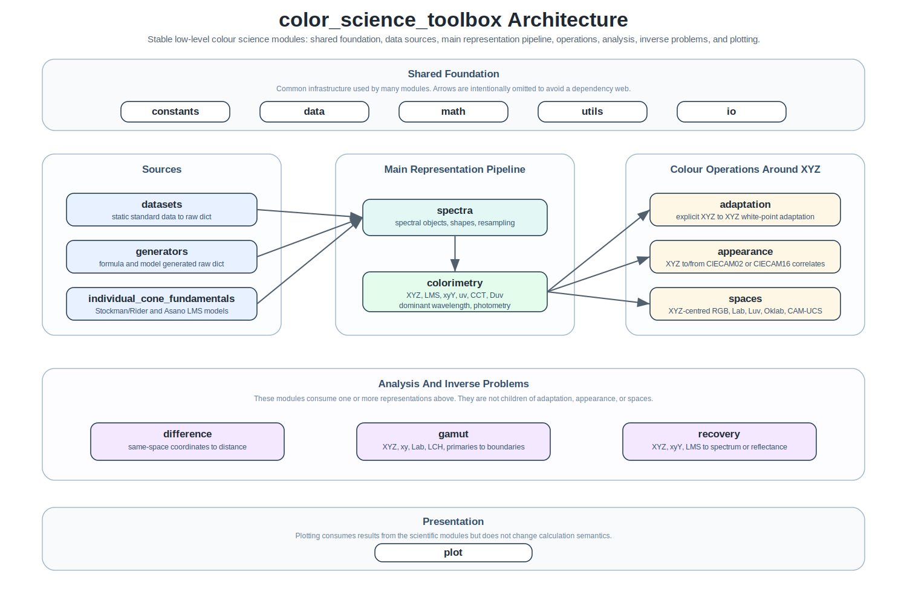

# color_science_toolbox

English documentation: [`readme.md`](readme.md)

`color_science_toolbox` 是一个底层颜色科学工具框架。它把标准数据、光谱对象、色度学计算、颜色空间转换、色貌模型、色差、色域、光谱恢复、设备响应优化、绘图和 IO 组织成一条清晰的计算链路。

## 架构总览

项目有一条清晰的表示链路：数据来源进入光谱对象，光谱对象进入色度学计算，
得到 `XYZ / LMS / xyY / uv / CCT / Duv` 等核心颜色量。其它模块不是这条链路的
简单上下级，而是围绕这些表示执行转换、比较、色域分析、反问题恢复、设备权重优化、绘图和读写。



核心原则：

- `datasets`、`generators` 和 `individual_cone_fundamentals` 是主要数据来源。
- `spectra -> colorimetry` 是最基础的正向表示链路。
- `adaptation` 是 `XYZ -> XYZ` 操作；`appearance` 是 `XYZ <-> 色貌 correlates`；`spaces` 是以 `XYZ` 为中枢的坐标转换。
- `difference` 消费已经处于同一空间的坐标；`gamut` 综合使用 `XYZ / xy / Lab / LCH / primaries / 标准色域数据`；`recovery` 从 `XYZ / xyY / LMS` 反向恢复光谱或反射谱，结果通常回到 `spectra` 再验证；`device` 从基色响应矩阵求解沉默替代等设备权重优化问题。
- `io` 归入基础边界模块，负责文件读写；`plot` 是展示层模块，只负责绘图，不改变科学计算语义。

## 环境配置

这是一个纯 Python 工具库。当前项目依赖在本仓库 `.venv` 中以 `Python 3.9.0`
验证可用，建议使用 `Python >= 3.9`。

PowerShell 下的最小配置流程：

```powershell
py -3.9 -m venv .venv
.\.venv\Scripts\python.exe -m pip install -r requirements.txt
.\.venv\Scripts\python.exe -m pytest -m "not examples" --import-mode=importlib -q --basetemp .pytest_tmp
```

`requirements.txt` 是当前固定依赖入口。日常开发建议优先跑相关模块测试，
完整测试策略见 [`TESTING_GUIDE.md`](TESTING_GUIDE.md)。

## 模块速览与最小用法

### Foundation

`constants / data / math / utils` 提供标准常量、内置文件、纯数值函数和跨模块
工具。它们通常作为其它模块的基础，不需要在普通工作流中直接组合很多代码。

```python
from color.constants import D65_XYZ
from color.math import gaussian_values
from color.utils import as_last_axis_triplets
```

### Data Sources

读取静态标准数据：

```python
from color.datasets import get_color_card, get_reflectance_spectrum

macbeth = get_color_card("macbeth")
munsell = get_reflectance_spectrum("munsell_matt")
```

生成公式或模型数据：

```python
from color.generators import daylight_spd, multi_gaussian_spd

d65_like = daylight_spd(cct=6500)
led_like = multi_gaussian_spd(peak_wavelengths=(450, 540, 620))
```

生成个体化 LMS cone fundamentals：

```python
from color.individual_cone_fundamentals import (
    generate_asano2016_individual_cone_fundamentals,
)

lms = generate_asano2016_individual_cone_fundamentals(
    age=40,
    field_size_degree=10,
)
```

### Spectral Objects

把原始列数据包装成光谱对象：

```python
from color.datasets import get_color_card
from color.spectra import from_columns

raw = get_color_card("macbeth")
patch = from_columns(raw, y="Blue Sky", name="Macbeth Blue Sky")
aligned = patch.align(patch.shape)
```

### Colorimetry

从光谱计算核心颜色量：

```python
from color.colorimetry import XYZ_to_xy, analyze_temperature, reflectance_to_XYZ

XYZ = reflectance_to_XYZ(patch, illuminant="D65")
xy = XYZ_to_xy(XYZ)
temperature = analyze_temperature(xy)
```

### Colour Models And Spaces

显式色适应：

```python
from color.adaptation import adapt_to_D65
from color.constants import D50_XYZ

XYZ_D65 = adapt_to_D65(XYZ, source_white_XYZ=D50_XYZ)
```

色貌模型：

```python
from color.appearance import XYZ_to_CIECAM16
from color.constants import D65_XYZ

spec = XYZ_to_CIECAM16(XYZ, XYZ_w=D65_XYZ, L_A=64, Y_b=20)
```

颜色空间转换：

```python
from color.constants import D65_XYZ
from color.spaces import SpaceSpec, convert_color

XYZ_D65 = SpaceSpec("XYZ", whitepoint_XYZ=D65_XYZ)
Lab = convert_color(XYZ, "XYZ", "Lab")
Oklab = convert_color(XYZ, XYZ_D65, "Oklab")
sRGB = convert_color(XYZ, "XYZ", "sRGB")
```

### Analysis And Inverse Problems

色差：

```python
from color.difference import delta_E_CIE2000

delta_E = delta_E_CIE2000(Lab, Lab)
```

色域分析：

```python
from color.gamut import analyze_gamut

analysis = analyze_gamut("Display P3")
print(analysis.xy_area, analysis.lab_volume)
```

设备响应优化：

```python
from color.device import PrimaryResponseDisplay, melanopic_silent_range

display = PrimaryResponseDisplay(
    primary_responses,
    response_names=("l", "m", "s", "mel"),
)
target_LMS = display.LMS_from_weights([0.35, 0.45, 0.30, 0.20])
low, high = melanopic_silent_range(display, target_LMS, held="LMS")
```

光谱或反射谱恢复：

```python
from color.recovery import recover_reflectance_from_XYZ

recovered = recover_reflectance_from_XYZ(
    XYZ,
    illuminant="D65",
    shape=patch.shape,
)
```

### Presentation And IO

绘图和保存：

```python
from color.io import save_figure
from color.plot import plot_lines, plot_style

with plot_style("presentation"):
    fig, ax = plot_lines(
        (patch.wavelengths, patch.values),
        xlabel="Wavelength (nm)",
        ylabel="Reflectance",
    )
save_figure("patch_reflectance.png", fig=fig)
```

读取光谱表格或图像：

```python
from color.io import read_image, read_spectral_csv

spectrum = read_spectral_csv("spectrum.csv", x="wavelength", y="spd")
image = read_image("image.png")
```

## 完整链路示例

完整可运行脚本位于
[`examples/integration/example_01_long_colour_pipeline.py`](examples/integration/example_01_long_colour_pipeline.py)。
它是根 README 的长链路 companion example，覆盖稳定主线中的主要模块。

运行：

```powershell
.\.venv\Scripts\python.exe examples\integration\example_01_long_colour_pipeline.py
```

脚本使用三类输入：

```text
1. generators -> spectra: 生成三峰 LED 自发光光谱。
2. spaces: encoded sRGB [0.4, 0.5, 0.6] 转 XYZ。
3. datasets -> spectra: 读取 Macbeth "Blue Sky" 反射谱。
```

核心链路：

```text
datasets / generators
-> spectra
-> colorimetry: XYZ, LMS, xy, relative Y, CCT+Duv, dominant wavelength
-> spaces: Lab, Luv, Oklab, CAM16-UCS
-> adaptation: D65 -> D50 for CAM16 viewing
-> appearance: CIECAM16 correlates
-> difference: CIEDE2000 against Macbeth Foliage
-> gamut: coarse sRGB gamut analysis
-> recovery: Blue Sky XYZ back to reflectance
-> plot/io: save original-vs-recovered reflectance figure
```

输出图像：

```text
examples/integration/output/01_long_colour_pipeline_reflectance_recovery.png
```

其中 `relative Y` 是 `XYZ` 中的相对亮度通道。对物体色 `xy` 做 `CCT / Duv`
分析是一种色度描述，不表示物体本身具有物理色温。

## 依赖边界

主要依赖：

- `numpy`：数组和数值计算基础。
- `scipy`：优化、插值、几何和部分数值算法。
- `pandas`、`openpyxl`、`xlrd`：CSV / Excel 数据读取。
- `matplotlib`：绘图。
- `Pillow`、`imageio`：图像 IO。

当前不覆盖或不作为重点：

- ICC/profile 管理。
- GUI 或交互式应用。
- 通用多基色设备颜色空间转换，或唯一 RGB/RGBC 权重求解。
- 显示器校准、LUT、时间调制和完整设备管理流程。
- CRI / TM-30 / CQS 等完整显色质量体系。

## 文档入口

每个主要模块通常有三层文档：

- `README.md`：英文快速入口。
- `README_DETAILS.md`：中文设计说明、边界和注意事项。
- `API_GUIDE.md`：中文顶层 API 使用手册。

## 测试

日常开发优先跑相关模块测试，完整建议见 [`TESTING_GUIDE.md`](TESTING_GUIDE.md)。

常用命令：

```powershell
.\.venv\Scripts\python.exe -m pytest color\<module>\tests -q --basetemp .pytest_tmp
.\.venv\Scripts\python.exe -m pytest -m "not examples" --import-mode=importlib -q --basetemp .pytest_tmp
.\.venv\Scripts\python.exe -m pytest -q --basetemp .pytest_tmp
```
